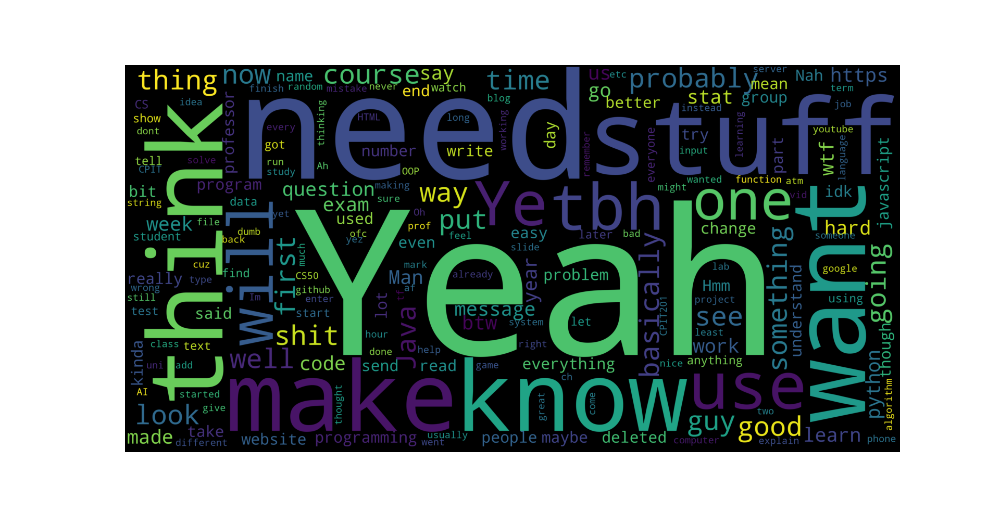

I realized I had a problem with the speed that I code. Furthermore, I always have a bunch of small projects which I wanted to quickly get done. Therefore I came up with the idea to get them done within only 15 minutes, so I can get other things done in a timely manner.

Form habits, make sure I remember what I learn

# First 15 Minute Challenge
Find out the most common words which I say in my Whatsapp Group Chat

## Goals:
- Obtain all of my text from the group chat
- Remove unwanted text
- Visualize the Text and Place it in this file
- Bonus: Add flexibility between people

## Result 1:

